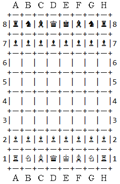

# Yet another implementation of Chess.

## Build

Required version of Java - **10**.

Command to build: **`mvn clean package`**

## Run

Run command: **`java -Dfile.encoding=UTF-8 -jar ./target/chess-1.0-SNAPSHOT.jar`** 

This application uses unicode characters. The console should support **UTF-8** as well as font.

Tested in the Intellij IDEA.

## Game

Note: This implementation supports almost all standard rules except Castling and Promotion.

Game starts right after starting of the application. Application prints help information with supported commands and expected input format.

Example of move input: '**e2 e4**'.

Board prints as on the following screenshot:

